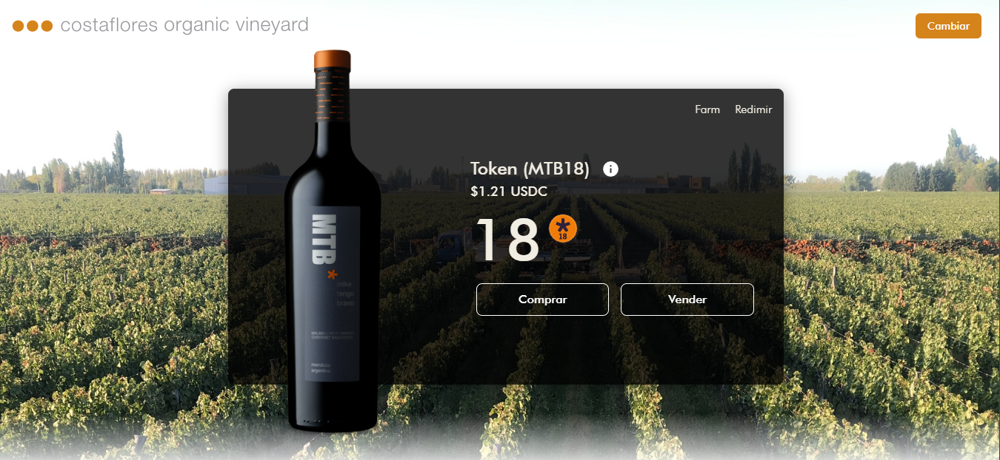

# OpenVino Exchange

Welcome to the **OpenVino Exchange** repository. This is a decentralized exchange built with **React** and **Vite** to support the OpenVino project. The exchange allows users to interact with various tokens, swap assets, and integrate with decentralized contracts using Thirdweb.

## Features

- Decentralized exchange functionality for OpenVino.
- Integrates with Thirdweb for easy contract interaction.
- Fully customizable with environment variables.
- Works alongside OpenVino's **redeem_dashboard** for redeeming tokens.

## Requirements

Before running the project, ensure you have the following tools installed:

- Node.js (version 14 or above)
- npm or yarn

## Getting Started

### 1. Clone the Repository

```bash
git clone https://github.com/openvino/exchange_vite.git
cd exchange_vite
```

### 2. Install Dependencies

Install the required dependencies using npm or yarn:

```bash
npm install
# or
yarn install
```

### 3. Environment Configuration

Create a `.env` file in the root of your project and configure the following environment variables:

```plaintext
VITE_TEMPLATE_CLIENT_ID=your_thirdweb_client_id
VITE_DASHBOARD_URL=https://your_next_dashboard_url
VITE_API_SECRET=your_api_secret_for_dashboard
VITE_APIURL=https://your_api_url_for_backend
VITE_ROUTER_ADDRESS=0xYourRouterContractAddress
VITE_WETH_ADDRESS=0xYourWETHContractAddress
VITE_FACTORY_ADDRESS=0xYourFactoryContractAddress
```

#### Explanation of Environment Variables:

- **VITE_TEMPLATE_CLIENT_ID**: Your Thirdweb Client ID. Used for connecting to the Thirdweb services.
- **VITE_DASHBOARD_URL**: URL of the dashboard built with Next.js, found at `https://github.com/openvino/redeem_dashboard`.
- **VITE_API_SECRET**: Secret key used to authenticate and connect with the redeem dashboard.
- **VITE_APIURL**: API URL for interacting with your backend services.
- **VITE_ROUTER_ADDRESS**: The smart contract address of the router that handles token swaps.
- **VITE_WETH_ADDRESS**: The Wrapped Ethereum (WETH) contract address.
- **VITE_FACTORY_ADDRESS**: The factory contract address responsible for creating token pairs.

### 4. Run the Development Server

Once the environment variables are set up, run the development server:

```bash
npm run dev
# or
yarn dev
```

The exchange should now be running on [http://localhost:3000](http://localhost:3000).

## Building for Production

To create a production build, run:

```bash
npm run build
# or
yarn build
```

Then, you can serve the build using a static file server:

```bash
npm run serve
# or
yarn serve
```




## Additional Information

- The dashboard URL points to the **redeem_dashboard** project on GitHub, which is a Next.js application that allows users to redeem their OpenVino tokens.
- The **API Secret** is necessary to establish secure connections with the dashboard and must be kept confidential.
- The exchange interacts with decentralized contracts such as the router and factory contracts using Thirdweb.

## License

This project is licensed under the MIT License.
```

This code block can be copied directly into your `README.md`.